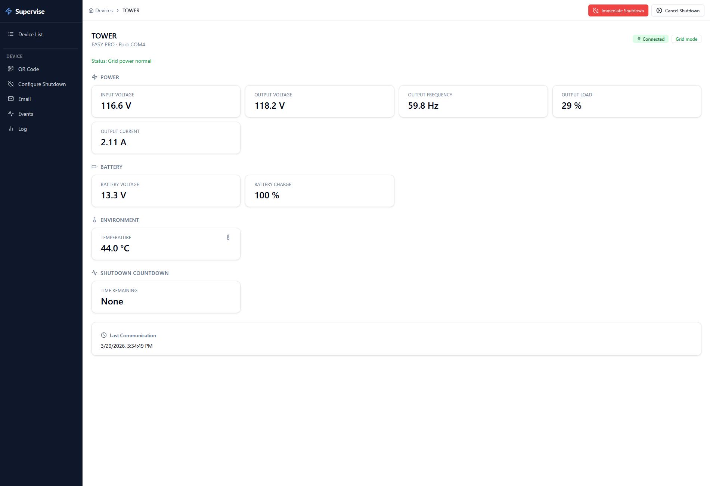

# Modernized version of Ragtech Supervise UPS monitoring app



---

## Development

```bash
npm install
npm run dev      # http://localhost:5173 (proxies /mon → http://localhost:4470)
```

---

## Native Deployment

Build the app and copy the output to the web root used by the Supervise backend.

**Build:**
```bash
npm install
npm run build
```

**Windows** — copy the contents of `dist/` to:
```
C:\Program Files (x86)\Supervise\web\
```

**Linux** — copy the contents of `dist/` to:
```
/opt/supervise/web/
```

Example (Linux):
```bash
cp -r dist/* /opt/supervise/web/
```

The backend serves these static files and also handles the `/mon/1.1/` API, so no additional proxy configuration is needed.

---

## Docker Deployment

The Docker image uses Apache httpd to serve the frontend and reverse-proxy `/mon/` requests to the Supervise backend, avoiding cross-origin (CORS) issues.

**Build the image:**
```bash
docker build -t supervise-web .
```

**Run — default backend (`http://ragtech:4470`):**
```bash
docker run -d -p 8080:8080 supervise-web
```

**Run — custom backend address:**
```bash
docker run -d -p 8080:8080 \
  -e API_UPSTREAM=http://<backend-host>:<port> \
  supervise-web
```

Replace `<backend-host>:<port>` with the actual address of the Supervise backend on your network. Examples:

| Installation        | `API_UPSTREAM` value          |
|---------------------|-------------------------------|
| Same host           | `http://localhost:4470`       |
| Local hostname      | `http://ragtech:4470`         |
| IP address          | `http://192.168.1.100:4470`   |

The frontend is then available at `http://<docker-host>:8080`.